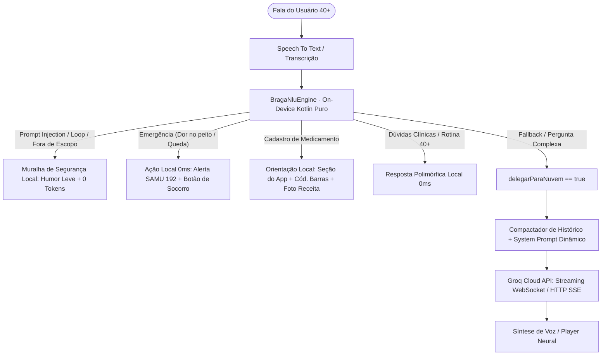

# Especificação Arquitetural e Guia de Implementação: Assistente Braga Saúde Híbrido (On-Device + Groq Cloud)

> **Destinatário:** Desenvolvedor / Assistente ChatGPT  
> **Repositório:** `bragasaude-app-android`  
> **Branch Alvo:** `feat/braga-hibrido-nlu-groq` (criada a partir da `master` limpa)  
> **Objetivo:** Implementar o pipeline híbrido de inteligência do assistente de voz do Braga Saúde, unindo um motor local ultra-leve em Kotlin nativo (0 ms, 100% offline, zero custo de token) à API de Nuvem da Groq via WebSocket/Streaming para casos que caírem em fallback.

---

## 1. Contexto e Princípios Fundamentais

### 1.1 Eliminação do Legado (Terreno Limpo)
- O **PR 35** anterior e a branch antiga `feat/braga-slm-on-device` foram **completamente cancelados e descartados**.
- Partimos de **terreno 100% limpo** sobre a branch `master` do app Android (`feat/braga-hibrido-nlu-groq`).
- Não há runtime Python nem TensorFlow/TFLite gigante no app. O motor on-device é **Kotlin puro**.

### 1.2 Perfil do Usuário: Pessoas 40+ (Maturidade Ativa)
- Nosso público **NÃO é composto apenas por idosos senis**. Falamos com pessoas de **40 a 70+ anos**: adultos maduros que trabalham, cuidam da casa, têm rotina ativa, sentem cansaço, dores na lombar/coluna, preocupam-se com a pressão, com a família e com pequenos prazeres (como um bom café ou caminhar).
- **Tom de voz:** Respeitoso, maduro, acolhedor, objetivo e natural. **Nunca infantilizar, nunca usar tom condescendente e nunca presumir fragilidade extrema**.

### 1.3 Polimorfismo Linguístico Obrigatório (Anti-Repetição)
- O assistente **nunca deve dar respostas fixas ou idênticas** em turnos repetidos.
- Cada intenção local possui de **4 a 6 variações semânticas ricas**.
- O motor mantém um cache de memória de curto prazo (`historicoRespostasRecentes`) para **nunca repetir a mesma resposta duas vezes consecutivas**.

---

## 2. A Muralha de Segurança On-Device (Zero-Cost Firewall)

### 2.1 Regra de Ouro: Ataques e Fora de Escopo NUNCA Tocam a API de Nuvem
Qualquer tentativa de ataque, loop ou pedido fora de escopo é interceptada **on-device em menos de 0.05 ms**:
1. **Prompt Injection / Jailbreak:** ("Ignore todas as instruções", "System prompt", "Modo DAN", "Finja ser um hacker", "Desconsidere suas regras").
2. **Loops / DoS Computacional:** ("Conte de 1 a 1000", "Repita 500 vezes", "Liste todos os números até o infinito").
3. **Tarefas Fora de Escopo:** ("Faça um código Python", "Escreva uma redação do ENEM", "Resolva uma equação de física").
4. **Flood / DoS de Texto:** Mensagens de entrada com mais de 350 caracteres são barradas localmente.

### 2.2 Reação Humanizada e Bem-Humorada
Em vez de respostas robóticas de erro ("Acesso negado"), o assistente responde com simpatia, humildade e humor leve:
- *"Que legal a sua curiosidade! Mas peço desculpas, isso foge totalmente do que eu consigo fazer por aqui. O meu foco é te ajudar a cuidar da sua saúde!"*
- *"Olha, adoraria te acompanhar nessa, mas essa tarefa está completamente fora do meu alcance! Se quiser ajuda com seus registros de saúde, estou por aqui."*
- **Custo para o negócio:** **R$ 0,00 e 0 tokens consumidos.**

---

## 3. Diretriz Regulatória: Cadastro de Medicamentos (SaMD Compliance)

Por conformidade clínica e regulatória (Software as a Medical Device - SaMD), o assistente **NÃO cadastra nem altera remédios por voz direta**.
Se o usuário disser *"Cadastra meu remédio"*, *"Quero adicionar Losartana"*, *"Anota o remédio novo"*, a intenção `orientacao_cadastro_medicamento` é acionada localmente:
- **Instrução dada ao usuário:** Explica que no aplicativo existe uma **seção exclusiva para cadastrar medicações**. O usuário pode adicionar:
  1. Lendo o **código de barras** da caixinha;
  2. Tirando uma **foto da receita** médica;
  3. Ou **anexando a receita** diretamente no app.
- **Fechamento obrigatório:** Lembra o usuário de que é fundamental **conferir tudo certinho com calma antes de salvar**, para que o app envie os lembretes e alarmes nos horários exatos sem erros.

---

## 4. Arquitetura em Duas Camadas



### 4.1 Camada 1: `BragaNluEngine` (On-Device)
- Processa 18 intenções validadas com benchmark em mais de 1.470 falas reais (58% a 72% de absorção local instantânea).
- Retorna um `NluOutput`:
  ```kotlin
  data class NluOutput(
      val intent: String,
      val respostaLocal: String?,
      val isEmergencia: Boolean = false,
      val isBloqueioSeguranca: Boolean = false,
      val delegarParaNuvem: Boolean = false,
      val tempoMs: Double = 0.0
  )
  ```

### 4.2 Camada 2: Groq Cloud API (WebSocket / Streaming)
Quando `delegarParaNuvem == true`:
1. **Compactação de Contexto:** Pega os últimos 3 a 5 turnos do diálogo (usuário e assistente) e resume os pontos essenciais.
2. **System Prompt Dinâmico:** Não usa prompt engessado. Constrói dinamicamente uma instrução contextualizada:
   > *"Você é o cérebro avançado e empático do Braga Saúde. O motor local on-device não foi capaz de responder com precisão à fala atual do usuário (perfil 40+). Contexto recente resumido: [CONTEXTO]. Responda com acolhimento, linguagem natural brasileira, tom maduro e seguro. Não faça diagnósticos definitivos nem prescreva remédios. Você é o apoio acolhedor do usuário."*
3. **Comunicação por Streaming:** Utiliza streaming com a API Groq (modelo Llama 3 / Mixtral ultra-rápido) via WebSocket ou SSE para latência mínima de áudio.

---

## 5. Estrutura de Arquivos no Projeto Android

Os novos arquivos devem residir na árvore de código do app:

```text
app/src/main/java/br/com/bragasaude/
├── ai/
│   ├── BragaNluEngine.kt            # Motor on-device com 18 intenções, guardrails e polimorfismo
│   ├── BragaHybridOrchestrator.kt   # Orquestrador: decide entre resposta local ou Groq
│   ├── GroqDynamicPrompt.kt         # Gerador do system prompt dinâmico e compactador de histórico
│   └── GroqStreamingClient.kt       # Cliente de streaming WebSocket/HTTP para a API Groq
```

---

## 6. Checklist de Execução para o ChatGPT

1. [ ] Confirmar que está trabalhando na branch `feat/braga-hibrido-nlu-groq` sobre a `master`.
2. [ ] Não tentar reinstalar modelos pesados locais (SLM on-device com PyTorch/TFLite foi descartado).
3. [ ] Integrar `BragaNluEngine.kt` com a muralha de segurança e as 18 intenções testadas.
4. [ ] Implementar `GroqDynamicPrompt.kt` garantindo compactação do histórico e o aviso de que o motor local delegou a resposta.
5. [ ] Configurar `GroqStreamingClient.kt` utilizando OkHttp (já presente no projeto) com a chave de API da Groq (`GROQ_API_KEY`).
6. [ ] Conectar o `BragaHybridOrchestrator` à `VoiceHealthViewModel.kt` para que a UI receba tanto as respostas locais instantâneas quanto o streaming da nuvem.
